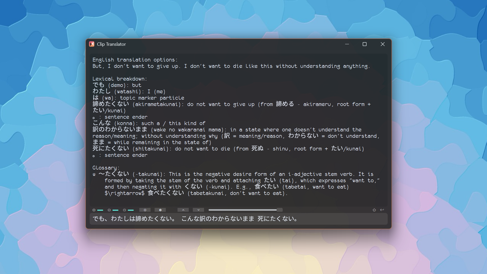

# Local Model Aux Projects

Auxillary gadgets for local model interactions

## Clip Translator
***A light-weight Local LLM GUI that automatically process clipboard contents with a local Ollama backend with customizable canned prompts***

We've all been there: You wanted to enjoy content created for a foreign audience, but the official translation was so inconsistent it made you dizzy. You wanted to introduce your friends to something you loved in another language, but the official translation missed the creative vision and became something entirely different. By putting in some effort as the readers ourselves, we can take back the control. That's what Clip Translator is created for. 

We know content localization is tough; it’s never just about the words. Plain, direct translations that omits all the nuances, overly enthusiastic localizations that warp the original flavor, or cheaply outsourced tasks that priortize speed over consistency all make their compromises in quality. To help bridge the gap between literal accuracy and cultural understanding, Clip Translator is designed to give you back the control: customize prompts to get not only a translation, but the linguistic context you need to make the final, nuanced interpretation yourself. Set up your ollama backend and Clip Translator will get to work, automatically process anything you put onto the clipboard. 

Beyond basic translation, you can also use the app to learn. Ask the model to feed you relevant knowledge about the language at hand. Vocab, grammar, cultural clues, you name it. Plus, your interaction history is automatically saved locally in a detailed JSON file, allowing you to track your learning journey or use the transcripts as a basis for your own fan translations and creative work.

> This is a translator app I made for cropping and interpreting game dialogues (that are otherwise poorly translated). It also serves as a simple Local LLM GUI. \
> The methodology is simple. The tech is simple. Nothing new. But I'll be glad if it can help you or otherwise inspire you. \
> Share with your friends if you find it useful; contribute to the development if you can; all are welcome. 

### Usage
#### Windows
- Make sure you have Ollama setup locally
    - By default, the model used is `gemma4`. You can change that in settings or the internal `config.toml` file 
- Download the distribution and run "Clip Translator"
- Customize your prompt in the settings menu or `config.toml`
    - If you need to change the source and/or targe language, make sure you change the prompt!
    - For fast response, strictly limit output in your prompt with phrases like "only include ...", "...\<a number\> or fewer ...\<something\>" and "do not include additional notes unless I ask."
    - For more nuanced (but predictable) response, reduce restrictive phrasings but add more suggestions like "include a lexical breakdown", "include a phonetic guide", "give me some pointers regarding the grammar rules involved", "incorporate past queries and provide a dynamic evaluation of the characterization of the speakers", "in bullet point format", "in table format", etc.
- Clip or copy things you want to translate (For OCR, using Snipping Tool's `Win` + `Shift` + `T` is recommended; I bound it to a macro key.)
    - **NEW** Use [TextCap](https://github.com/acultural/ScreenCapture) for easier ocr. In `config.toml`, set `use_ocr` to `true` and provide a valid `ocr_path` to the executable.
- If the model response seems off, try to reload. The seed is not fixed, and there is a change for getting a bad one.
- Session history is kept by default so you can do contextual inference if prefered. However a long session will reduce model efficiency. Reload to clear message history (the initial prompt will be load, and all history will be still be kept in the `cache.json`) 
- You can move or delete `cache.json` based on your needs. If missing, it will always be created in the working directory of where you are running this app
- **Note**: first launch can take some time 
- Read the following section for more details

#### MacOS
- Untested/Unbuilt

#### Linux
- Untested/Unbuilt

### UI and Controls
#### Main GUI
- Top Frame: Rendered response from the backend.
- Middle Frame (the line between top and bottom frame): status and controls bar. It is made tiny to take up very little space
- Bottom Frame: The Input text box. Content automatically read from the clipboard will also appear here.

#### Status Bar
- Status lights (blue is on (True), orange is off (False)) (left to right) : 
    - is monitoring clipboard / ocr output
    - is backend ready
    - is backend idle (orange then means busy)
- Buttons (left to right): 
    - clipboard monitoring toggle
    - pause/restart toggle
    - settings menu toggle
    - previous query
    - next query
    - query history quick scroll bar 

#### Settings Menu
Change the model, cache path here. **Most importantly, customize your initial prompt here.**\
Initial response can be set and toggled on for additional stability.\
Reload with settings to apply them.

#### Hotkeys
- `Shift` + `Enter` to submit manually entered messages
- `Ctrl` + `-` to shrink the UI
- `Ctrl` + `=` to expand the UI

### Customization
The internal `config.toml` file contains all exposed and some unexposed settings for you to mess with.
#### Font
By default, **Monofur Nerd Font Mono** is shipped with the distribution. On MacOS and Linux, it cannot be loaded directly, so default font will be used and some glyphs will be missing.\
You can also install any **Nerd Font** alternatives and change the settings in `config.toml`.
#### Opacity
Change the `alpha` value
#### Default Scale
Change the `scale` value

### Issue Diagnosis and Reporting
- The app creates log files in the internal folder. Take a look to see where the issue may have occured and attach relevant bits to your report. Thank you!

### Build
`pyinstaller --onedir --add-data "assets:assets" --add-data "external:external" --add-data "config.toml:." --icon=assets\icon.ico --name "Clip Translator" -w translator.py`
- `external` contains a forked copy of CTkMarkdown; it may or may not be necessary in the future (and is therefore not included as a submodule). For now, copy the `.py` file from my other repo and place it there before building. 

## Credits
Screenshot background: [Justcos@pixabay](https://pixabay.com/illustrations/sunrise-sunset-colours-background-1030593/) 

## Maintainer's Dev Notes:
### Venv
`.\localModelAux\Scripts\Activate.ps1`

### Below are some reference materials
#### Simple SVG visual editor
    https://www.svgviewer.dev/
#### Color picler
    https://htmlcolorcodes.com/color-picker/
#### About SVG gradient
    https://developer.mozilla.org/en-US/docs/Web/SVG/Tutorials/SVG_from_scratch/Gradients
#### The SVG path guide I always use
    https://www.joshwcomeau.com/svg/interactive-guide-to-paths/